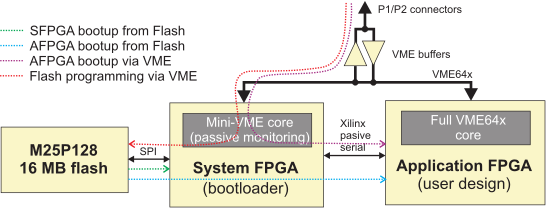

..
  SPDX-License-Identifier: CC-BY-SA-4.0
  SPDX-FileCopyrightText: 2019-2020 CERN

The SVEC Bootloader
===================

The System FPGA bootloader allows to boot the Application FPGA from the VME bus or from the onboard Flash memory and reprogram both the System and Application bitstreams in the flash via VME (see @ref{fig:boot_modes}). The boot process goes as follows:

#. Power up,
#. SFPGA checks for presence of a valid bitstream file for the Application FPGA in the Flash memory,
#. if a valid bitstream has been found, the AFPGA is initialized with it,
#. if not, the Bootloader enters passive mode. Upon reception of a boot sequence, if gives access to the Flash for the host or lets it program the AFPGA directly.

   Boot modes of the SVEC card

Bootloader versions
-------------------

There are three versions of the bootloader in use:

- **Version 1** which only allows booting the Application FPGA via VME (no flash
  support). This version of the bootloader has been programmed in older SVEC
  cards. If the VME flasher (``svec-flasher``) tool is unable to detect the
  flash memory, you're likely running the old bootloader.
- **Version 2** which supports everything described in this manual except for
  providing SPI flash access to the AFPGA.
- **Version 3** which supports everything described in this manual, including
  accessing the SPI flash from the AFPGA.

The new version is software-compatible with the old one, there is no need to update any drivers. The register description applies to both versions, except that for the version 1, the Flash Access Register (``FAR``) is not functional.

.. note:: When possible update to the latest version

.. note:: Following documentation assumes version 3

VME Interface
-------------

The bootloader core supports only 32-bit data CR/CSR accesses from/to address
range ``0x70000 - 0x70020``, allowing for plug&play reprogramming of the cards
only knowing their physical slot locations. All other transfers are ignored. The
base address is ``0x70000``, and corresponds to the ``CSR`` register. When the
card is powered up, the VME interface stays in passive mode, monitoring VME
accesses without ACKing them. This is to prevent conflicts with the CR/CSR space
of the VME core in the Application FPGA. To access the bootloader VME interface,
one needs to write the magic sequence of 8 following transfers: ``0xde``,
``0xad``, ``0xbe``, ``0xef``, ``0xca``, ``0xfe``, ``0xba``, ``0xbe`` to the
``BTRIGR`` register (for register definitions, @pxref{System FPGA Register
Map``).

Entering Bootloader Mode
~~~~~~~~~~~~~~~~~~~~~~~~

To check if the bootloader has been activated, read the ``IDR`` register. It
should be equal to ``SVEC`` ASCII string encoded in HEX. Any other value
indicates that the boot trigger sequence was not correctly recognized, the
System FPGA is unprogrammed, the geographical address of the card is wrong or
that the card itself is faulty.

.. note:: Triggering bootloader mode causes automatic reset (un-programming) of
          the Application FPGA.

.. note:: Since the bootloader core supports only 32-bit transfers, one must
           extend the magic values with zeroes (e.g. ``0x000000de``, etc.) and
           write full 32-bit words. Attempts to write the magic sequence as
           single bytes (D8 transfer mode) will be ignored.

.. note:: Trigger sequence must not be interleaved with other accesses to the
          bootloader address range of the same card.

.. note:: Write operations to ``BTRIGR`` register while the bootloader is in
          passive mode will not be acknowledged on the VME bus and may sometimes
          cause bus errors to be reported by the host VME driver. They are not
          harmful, though.

Programming the AFPGA
~~~~~~~~~~~~~~~~~~~~~

Programming the Application FPGA directly via VME involves the following steps:

#. Reset the Xilinx Passive Serial boot interface by writing the ``CSR.SWRST`` bit,
#. Set download speed by writing the ``CSR.CLKDIV`` field. Default value is ``1``,
#. Write the ``CSR.START`` bit and set endianness via the ``CSR.MSBF`` bit,
#. Write the bitstream to the FIFO registers, observing FIFO full/empty status.
   The last transfer should have ``FIFO_R1.XLAST`` bit set to 1,
#. Wait for assertion of ``CSR.DONE``. ``CSR.ERROR`` bit indicates a problem
   during configuration (most likely, an invalid bitstream),
#. Exit bootloader mode by writing 1 to ``CSR.EXIT`` bit.

A code example is available in the repository (@pxref{repo_link,,3}). Successful gateware download to the Application FPGA is indicated by turning on the ``AFPGA DONE`` LED in the middle of the PCB.

Programming The Flash
---------------------

The bootloader also allows raw access to the Flash memory (`M25P128`_ or `MT25QL128`_
in newer SVEC cards) via the ``FAR`` register. Low-level details about programming the Flash memories can be found in their datasheets.

.. note:: It is advised to protect the region of the flash containing the system
          FPGA bitstream from being accidentally overwritten, as this will
          result in rendering the card unusable and will require re-programming
          the flash via JTAG. Details on memory protection can be found in the
          Flash memory datasheet.

.. note:: The freshly-programmed bitstreams will be loaded into the FPGAs after
          power-cycling the card. In order to avoid the power cycle, one can
          boot the Application FPGA directly using the same bitstream.

.. _`M25P128`: http://www.micron.com/parts/nor-flash/serial-nor-flash/m25p128-vme6gb
.. _`MT25QL128`: https://www.micron.com/-/media/client/global/documents/products/data-sheet/nor-flash/serial-nor/mt25q/die-rev-a/mt25q_qlhs_l_128_aba_0.pdf

The ``svec-flasher``
~~~~~~~~~~~~~~~~~~~~

The tool ``software/tools/vme-flasher/svec-flasher`` accesses the VME interface
to program the SPI flash with a bitstream (``.bin`` format) targeting the AFPGA.
With the option ``-b``, it is also possible to program the SPI flash with a
bootloader bitstream. Finally, with the option ``-f``, it is possible to program
directly the AFPGA.

.. warning:: Before programming the flash, please unload the SVEC kernel driver
             using ``rmmod svec-fmc-carrier``

.. warning:: Programming incorrect bootloader bitstream or a failure of
             bootloader update process will render your card unusable. In such
             case, the card can be recovered by programming the bootloader
             through JTAG. The flasher tool asks for additional confirmation
             before reprogramming the memory.

.. note:: The card must be rebooted for the new bitstream to be loaded to the
          Application FPGA.

Updating the bootloader through JTAG
-------------------------------------

If you have the bootloader version 1 or 2, or you corrupted the SPI flash, then
JTAG is your only option to program the SPI flash with the latest bootloader
version. The procedure goes as follows.

#. Download the latest bootloader ``svec-bootloader-[latest release].mcs`` from
   `Release <http://www.ohwr.org/projects/svec/wiki/Releases>`_.
#. Connect Xilinx JTAG programmer to the JTAG connector of the card to be
   updated.
#. Launch ISE iMPACT.
#. Double-Click ``Boundary Scan`` in the left pane (``iMPACT flows``).
#. Open the right-click menu in the main work area and select ``Initialize
   chain`` or press ``Ctrl+I``.
#. Right click on the ``SPI/BPI ?`` box above the ``xc6slx9`` FPGA and select
   ``Add SPI/BPI Flash``.
#. Pick the ``svec-bootloader-[latest release].mcs`` file.
#. Select flash type: SPI PROM, M25P128 (or N25Q128 if you have a newer SVEC
   with a MT25QL128 Flash memory chip), data width: 1.
#. Right click on the ``FLASH`` chip above the ``xc6slx9`` and select
   ``Program``. Select the ``Verify`` option and click OK.
#. If everything went fine, ``Programming succeeded`` message will appear.
#. Reboot the VME crate to use the new bootloader.

.. note:: Updating the bootloader does not require updating the drivers, as it
          is backwards-compatible.

Memory Map
----------

.. include:: svec_xloader_regs.rst
